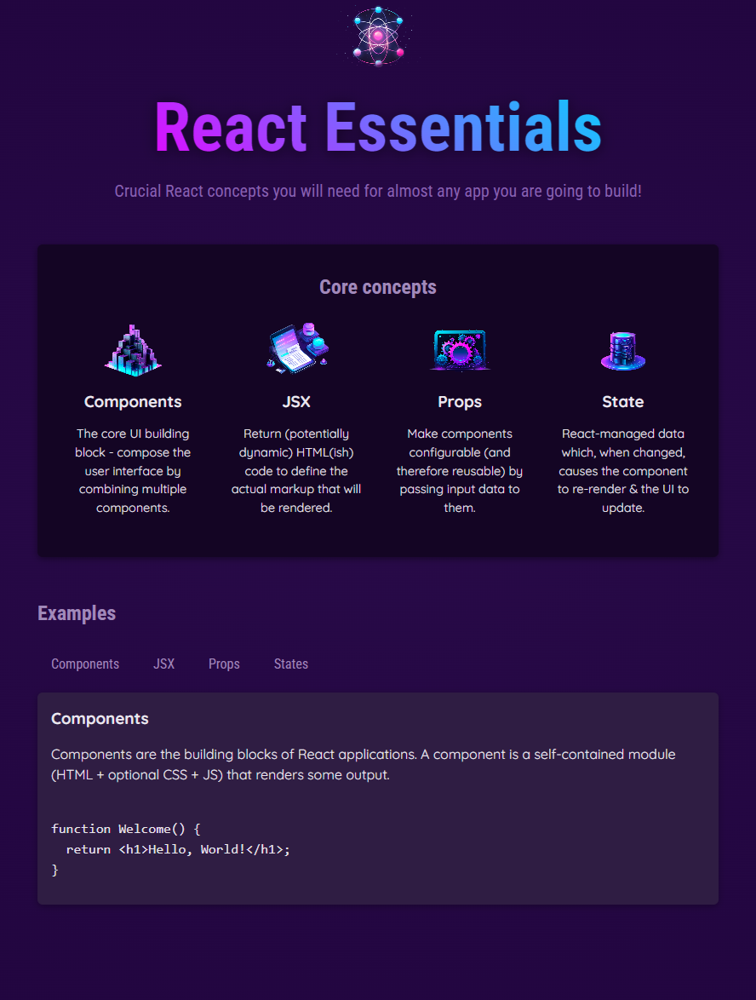

# 🧠 React Essentials Playground

This is a small project built during my learning journey through the [React - The Complete Guide (incl. Redux)](https://www.udemy.com/course/react-the-complete-guide-incl-redux/) course on Udemy.  
This project focuses on fundamental React concepts like **Components, JSX, Props, and State**—all wrapped in an interactive playground.

## 📸 Preview

## 🧩 Features

- 💡 Explanation of core React concepts:

  - Components
  - JSX
  - Props
  - State

- 🔘 Tab-based UI to display different examples interactively.
- 🧼 Clean file structure with reusable components.

## 📂 Project Structure

src/
├── assets/ # Icons & images
├── components/ # Reusable React components
│ ├── Header/
│ ├── CoreConcept.jsx
│ └── TabButton.jsx
├── App.jsx # Main App component
├── data.js # Static data for examples & core concepts
└── index.css # Global styles

## 🧠 What I Learned

This section of the course covered:

- The role of components in React apps and how they form a tree structure.
- JSX syntax and dynamic value output.
- Props and the different ways to pass data between components.
- Event handling and state management using React hooks.
- Component composition and usage of `children`.
- Styling strategies and best practices.

## 🚀 Getting Started

1.  **Clone the repo:**

        `git clone https://github.com/your-username/react-essentials-playground.git

    cd react-essentials-playground`

2.  **Install dependencies:**

    `npm install`

3.  **Start the dev server:**

    `npm run dev`

4.  Open your browser and go to the provided URL in your terminal.

## 📚 Built With

- [React](https://reactjs.org/)
- [Vite](https://vitejs.dev/) - blazing fast dev environment
- Basic CSS styling

## 📖 Course Info

**Course:** React - The Complete Guide (incl. Redux)  
**Instructor:** Maximilian Schwarzmüller  
**Section:** _React Essentials - Components, JSX, Props, State & More_
